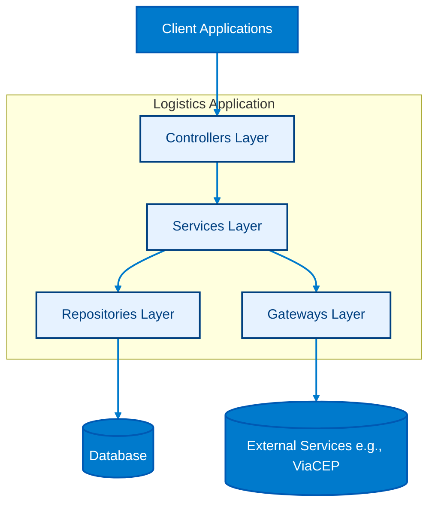

# ShopBridge - Logistics Service

This repository implements the **Logistics Service** of the ShopBridge system, designed as part of the **MVP project for the Advanced Back-End module of the Full-Stack Development postgraduate program at CCEC - PUC-Rio**. The service provides a fully functional API for managing shipments, enabling creation, retrieval, update, and deletion of shipment data in a microservices architecture.

Developed using **ASP.NET Core**, the service follows a layered architecture and adheres to industry best practices for RESTful APIs. It is designed to be integrated seamlessly into the system orchestration layer via Docker Compose.

---

## Repository Structure

```
shopbridge_logistics/
├── LogisticsAPI/                          # Main Web API project
│   ├── Controllers/                       # HTTP endpoints (API controllers)
│   ├── Data/                              # EF Core DbContext and configuration
│   ├── Migrations/                        # EF Core database migrations
│   ├── Models/                            # Domain entities, DTOs, and value objects
│   │   ├── DTOs/                          # Data Transfer Objects for API contracts
│   │   ├── Entities/                      # Domain entities mapped to persistence
│   │   └── ValueObjects/                  # Immutable value objects
│   ├── Gateways/                          # External service integrations (e.g., ViaCEP)
│   ├── Repositories/                      # Data persistence and query abstractions
│   ├── Services/                          # Business logic and application services
│   ├── Properties/                        # Project metadata (launchSettings.json, etc.)
│   ├── LogisticsAPI.csproj                # Project definition file
│   └── README.md                          # Project-specific documentation
│
├── LogisticsAPI.Tests/                    # Test project
│   ├── Controllers/                       # Unit tests for API controllers
│   ├── Repositories/                      # Unit tests for repositories
│   ├── Services/                          # Unit tests for services
│   ├── Gateways/                          # Unit tests for external integrations
│   └── LogisticsAPI.Tests.csproj          # Test project definition
│
├── README.md                              # Root-level documentation
├── .gitignore                             # Git ignore rules
└── LogisticsAPI.sln                       # Solution file
```

---

## Service Design Overview

The **Logistics Service** follows a layered architecture to ensure separation of concerns, scalability, and maintainability. In addition to repositories for database access, the architecture includes gateways, which abstract and encapsulate calls to external services (e.g., address validation via ViaCEP). This separation ensures that external dependencies are isolated, making the system easier to test, extend, and maintain.

<p align="center">



</p>


### Key Design Principles
- **Layered Architecture**: Controllers → Services → Repositories → Database
- **Domain-Driven Design (DDD) Lite**: Models and DTOs represent business entities clearly.
- **Persistence**: EF Core with SQLite for local development; easily swappable for other providers.
- **RESTful API**: Follows standard HTTP verbs and status codes.
- **Microservices Ready**: Designed to run independently and integrate via Docker networking.

### Design Decisions
- **Controllers** handle HTTP requests and delegate logic to services.  
- **Services** encapsulate business rules and orchestrate data flow.  
- **Repositories** abstract persistence, making the service database-agnostic.  
- **Migrations** ensure schema evolution is tracked and reproducible.  
- **Tests** validate each layer independently (unit + integration).  

---

## Getting Started

### 1. Clone the repository
```bash
git clone https://github.com/mattsimoessilva/shopbridge_logistics.git
cd shopbridge_logistics
cd LogisticsAPI
```

### 2. Run the service
You can run the service locally via Docker Compose (from the orchestration repository) or directly using `dotnet run`:

```bash
dotnet run --project LogisticsAPI.csproj
```

The API will be available at **http://localhost:8001**.

---

## Managing the Database

The service uses **Entity Framework Core (EF Core)** with **SQLite** for persistence.  
Below is a catalog of the most common commands you’ll need when working with the database.

### Add a new migration
Creates a new migration file to track schema changes.
```bash
dotnet ef migrations add MigrationName 
```

### Apply migrations
Applies all pending migrations to the database.
```bash
dotnet ef database update
```

### Remove the last migration
Rolls back the last migration (only if it hasn’t been applied to the database yet).
```bash
dotnet ef migrations remove
```

### Reset the database
Drops the database and recreates it with the latest migrations.
```bash
dotnet ef database drop
dotnet ef database update
```

---

## Running Unit Tests

Unit and integration tests are located in the **LogisticsAPI.Tests** project.  
Below is a catalog of the most common commands for running and filtering tests.

### Run all tests
Executes the entire test suite.
```bash
dotnet test
```

### Run tests with detailed output
Provides verbose output for better debugging and visibility.
```bash
dotnet test -v n
```

### Run a specific test class
Runs only the tests within a specific class.
```bash
dotnet test --filter FullyQualifiedName~Namespace.ClassName
```

### Run a specific test method
Runs a single test method within a class.
```bash
dotnet test --filter FullyQualifiedName~Namespace.ClassName.MethodName
```

---

## API Endpoints

### Shipments

| Method | Endpoint                          | Description                                                                 |
|--------|-----------------------------------|-----------------------------------------------------------------------------|
| POST   | `/api/shipments`                  | Create a new shipment record.                                               |
| GET    | `/api/shipments`                  | Retrieve all shipment records.                                              |
| GET    | `/api/shipments/{id}`             | Retrieve a shipment record by its unique ID.                                |
| PUT    | `/api/shipments`                  | Update an existing shipment record.                                         |
| DELETE | `/api/shipments/{id}`             | Delete a shipment record by its unique ID.                                  |
| PATCH  | `/api/shipments/{id}/status`      | Update only the status of a shipment record.                                |

---

### Shipping

| Method | Endpoint                          | Description                                                                 |
|--------|-----------------------------------|-----------------------------------------------------------------------------|
| POST   | `/api/shipping/availability`      | Check if a destination address is valid and serviceable for shipping.       |

---

All endpoints follow REST conventions and return appropriate HTTP status codes (200, 201, 204, 400, 404, 500) with JSON payloads.

---

## Notes

- The service uses **SQLite** for local persistence.  
- It is designed to operate as part of the **ShopBridge microservices system**, communicating with other services via internal Docker networking.  
- All timestamps are in ISO 8601 format, and UUIDs are used for unique identification of records.

---

## References

[1] S. Newman, *Building Microservices: Designing Fine-Grained Systems*. O’Reilly Media, 2015.  
[2] Microsoft, *ASP.NET Core Documentation*, 2025. Available: https://docs.microsoft.com/aspnet/core.
